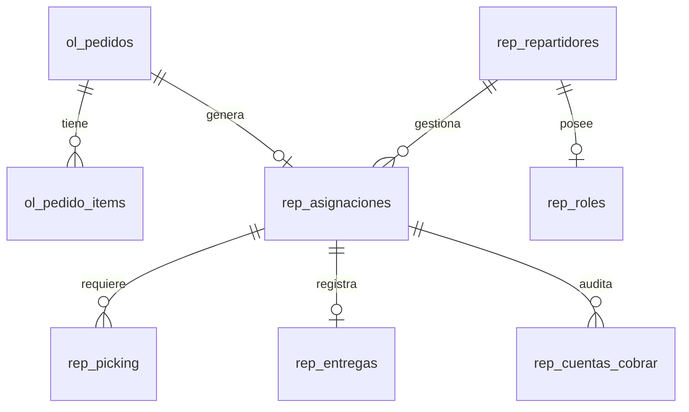

# Especificación Técnica y Blueprint Arquitectónico: Ecosistema La Crayola

Este documento sirve como la **especificación técnica definitiva y manual del desarrollador** para el ecosistema de comercio local y despacho de **La Crayola** en San Miguel de los Bancos. Está redactado en lenguaje técnico formal para que tu programador comprenda de inmediato el diseño de base de datos, flujos de estado, integraciones sin servidor, RLS (Row Level Security), y el motor lógico del sistema.

---

## 🏗️ 1. Arquitectura del Sistema y Stack Tecnológico

El ecosistema está construido bajo un patrón desacoplado en tiempo real:

1.  **Frontend del Cliente (`tienda-lacrayola`)**: Aplicación web desarrollada en **Next.js 16 (App Router)** y **Tailwind CSS**. Opera del lado del cliente final para recolectar las compras y consolidar múltiples tiendas en un solo viaje.
2.  **App de Operaciones Celular (`reparto-lacrayola`)**: PWA (Progressive Web App) en **Next.js 16 (Turbopack)** para colaboradores móviles (Shoppers y Riders) y administradores en campo.
3.  **BaaS (Backend-as-a-Service - Supabase)**:
    *   **Postgres**: Motor relacional con Row Level Security (RLS) habilitado.
    *   **Supabase Realtime**: Escucha en caliente de transacciones (usado para detectar el traspaso de pedidos por QR instantáneamente).
    *   **Postgres Triggers & PL/pgSQL**: Control lógico de billeteras contables en el motor de base de datos para evitar fraude o desvíos de efectivo en tiempo real.

---

## 📊 2. Esquema y Modelos de Base de Datos (Postgres)

A continuación se detallan las principales relaciones y tablas involucradas en el flujo operativo:



### 📋 Detalle Técnico de Tablas Clave

#### A. Tabla: `ol_pedidos`
*   `id` (uuid, PK): Identificador único de la orden.
*   `numero` (serial): Número secuencial del pedido visible al cliente (ej. `#0012`).
*   `estado` (varchar): Estados del pedido: `'pendiente'`, `'preparado'`, `'enviado'`, `'entregado'`.
*   `total` (numeric): Costo total consolidado de los artículos de todas las tiendas.
*   `total_items` (integer): Cantidad total de productos.
*   `nombre_cliente`, `telefono`, `email_cliente` (varchar): Datos de contacto y facturación del cliente.
*   `direccion`, `ciudad`, `referencias` (text): Datos de localización del cliente.
*   `geo_lat`, `geo_lng` (numeric): Ubicación GPS exacta capturada por Geolocation API en el Checkout.
*   `notas` (text): Campo flexible utilizado para guardar aclaraciones del cliente y los **metadatos del comprobante SRI facturado** (`[SRI-BILLING] Factura: ... | RUC: ...`).

#### B. Tabla: `rep_repartidores`
*   `id` (uuid, PK): Identificador del repartidor/shopper.
*   `user_id` (uuid, FK a auth.users): Vínculo de inicio de sesión de Supabase Auth.
*   `nombre`, `cedula`, `telefono`, `email` (varchar): Ficha del colaborador.
*   `efectivo_en_mano` (numeric): La **Billetera de Efectivo (Cash Wallet)** acumulada por cobros COD en calle.
*   `estado` (varchar): Estados de control operativo: `'ACTIVO'`, `'BLOQUEADO'`, `'INACTIVO'`.
    *   *Constraint CHECK*: `estado IN ('ACTIVO', 'BLOQUEADO', 'INACTIVO')`
*   `estado_registro` (varchar): `'pendiente'`, `'aprobado'`, `'rechazado'` (para solicitudes de registro).

#### C. Tabla: `rep_roles` (Seguridad y Control de Accesos)
*   `user_id` (uuid, PK, FK a auth.users): El identificador único de usuario.
*   `rol` (varchar): Los perfiles disponibles en el ecosistema: `'superadmin'`, `'admin'`, `'supervisor'`, `'contador'`, `'repartidor'`.
*   `activo` (boolean): Flag de habilitación del rol.

#### D. Tabla: `rep_asignaciones`
*   `id` (uuid, PK): ID único de la asignación (usado como clave de seguridad y QR).
*   `pedido_id` (uuid, FK a `ol_pedidos`): Pedido asociado.
*   `repartidor_id` (uuid, FK a `rep_repartidores`): El Shopper/Rider asignado actualmente.
*   `estado` (varchar): Estados de la entrega:
    *   `'asignado'`: Pedido aceptado por el Shopper para picking.
    *   `'recolectado'`: Compras hechas y pagadas en Tuti/Tía (Listo para entrega/traspaso).
    *   `'en_ruta'`: En camino al domicilio del cliente.
    *   `'entregado'`: Entregado y cobrado.
    *   `'devuelto'`, `'cancelado'`: Estados de excepción.

#### E. Tabla: `rep_picking` (El Checklist de Supermercados)
*   `id` (uuid, PK): ID de la línea de recolección.
*   `pedido_id` (uuid, FK a `ol_pedidos`): Orden asociada.
*   `tienda_id` (uuid, FK a `ol_tiendas`): Comercio físico (Tuti, Tía, etc.) donde se realiza la compra.
*   `descripcion` (varchar): Nombre y detalle del producto.
*   `cantidad` (integer): Cantidad física a comprar.
*   `precio_ref` (numeric): Precio referencial de la tienda en línea.
*   `precio_real` (numeric): Precio real capturado en la caja registradora.
*   `estado` (varchar): Estado de picking de la línea: `'pendiente'`, `'recogido'`, `'no_disponible'`, `'sustituido'`.
*   `sustitucion` (text): Nota explicativa del reemplazo sugerido al cliente.

---

## ⚡ 3. Control de Caja y Triggers en Base de Datos (Postgres PL/pgSQL)

Para asegurar la integridad financiera del ecosistema y evitar fraudes o errores humanos, la lógica de control contable y bloqueo automático está **incrustada en el motor de base de datos (Postgres)**, garantizando que opere independientemente de si la petición viene del frontend, la PWA o scripts externos:

### A. Trigger A: Bloqueo Automático de Repartidores por Límite de Efectivo
Un trigger de base de datos audita cada actualización en la billetera del motorizado (`efectivo_en_mano`). Si el saldo supera el límite máximo permitido de **$40.00**, el trigger cambia inmediatamente el estado del repartidor a `'BLOQUEADO'`.

```sql
CREATE OR REPLACE FUNCTION check_limite_caja_repartidor()
RETURNS TRIGGER AS $$
BEGIN
  IF NEW.efectivo_en_mano > 40.00 THEN
    NEW.estado := 'BLOQUEADO';
  ELSE
    -- Solo reactivar a ACTIVO si estaba bloqueado previamente
    IF OLD.estado = 'BLOQUEADO' AND NEW.efectivo_en_mano <= 40.00 THEN
      NEW.estado := 'ACTIVO';
    END IF;
  END IF;
  RETURN NEW;
END;
$$ LANGUAGE plpgsql;

CREATE TRIGGER trigger_limite_caja_repartidor
BEFORE UPDATE OF efectivo_en_mano ON rep_repartidores
FOR EACH ROW
EXECUTE FUNCTION check_limite_caja_repartidor();
```

### B. Procedimiento Almacenado (RPC): Conciliación Contable y Liquidación
Cuando el repartidor entrega el dinero físico cobrado al Administrador o al **Contador**, el sistema ejecuta una función PL/pgSQL segura en el servidor que debita la billetera, registra la auditoría y desbloquea su estado automáticamente en una sola transacción atómica.

```sql
CREATE OR REPLACE FUNCTION conciliar_caja_repartidor(
  p_repartidor_id UUID,
  p_monto_abono NUMERIC,
  p_notas TEXT,
  p_usuario_auditor TEXT
) RETURNS VOID AS $$
DECLARE
  v_efectivo_actual NUMERIC;
BEGIN
  -- 1. Obtener saldo actual en caja chica del rider
  SELECT efectivo_en_mano INTO v_efectivo_actual
  FROM rep_repartidores
  WHERE id = p_repartidor_id;

  IF v_efectivo_actual IS NULL THEN
    RAISE EXCEPTION 'Repartidor no encontrado';
  END IF;

  -- 2. Registrar la auditoría contable en rep_liquidaciones
  INSERT INTO rep_liquidaciones (
    repartidor_id,
    fecha,
    total_cobrado,
    total_a_entregar,
    estado,
    notas,
    liquidado_por
  ) VALUES (
    p_repartidor_id,
    CURRENT_DATE,
    v_efectivo_actual,
    p_monto_abono,
    'liquidado',
    COALESCE(p_notas, 'Conciliación de caja estándar'),
    p_usuario_auditor
  );

  -- 3. Descontar efectivo y actualizar estado si baja del límite ($40)
  UPDATE rep_repartidores
  SET efectivo_en_mano = GREATEST(0.00, efectivo_en_mano - p_monto_abono)
  WHERE id = p_repartidor_id;

END;
$$ LANGUAGE plpgsql;
```

---

## 🔄 4. Flujo Técnico Etapa por Etapa

### 🛒 Etapa 1: Carrito Consolidado Multitienda y Checkout
*   **Qué hace**: Agrupa productos de múltiples supermercados (Tuti, Tía) y calcula el envío consolidado.
*   **Por qué lo hace**: Ofrece al cliente la facilidad de recibir compras de múltiples comercios en un solo viaje y pagar una tarifa de envío inteligente.
*   **Cómo lo hace**:
    *   *Lógica del Carrito (`lib/carrito.ts`)*: Estructura los productos almacenados en `localStorage` inyectando propiedades de control: `tienda_id` y `tienda_nombre`.
    *   *Fórmula del Envío Consolidado*: 
        $$\text{Costo Envío} = \$1.50 \text{ base (primer comercio)} + (\$0.75 \times (\text{Comercios Adicionales}))$$
    *   *Inserción Serverless (`app/checkout/actions.ts`)*: El server action `crearPedido` realiza una transacción que inserta el pedido consolidado en `ol_pedidos` y segmenta e inyecta las tareas de recolección en `rep_picking` agrupándolas por su respectivo `tienda_id`.

---

### 🧺 Etapa 2: Aceptación de Pedido por el Shopper (Auto-Asignación)
*   **Qué hace**: Permite a los Shoppers visualizar la cola de pedidos en espera en Modo Compras, auto-asignarse la orden y notificar al cliente.
*   **Por qué lo hace**: Agiliza la operación sin requerir un despachador administrativo en horas pico, y avisa al cliente de inmediato para generar confianza.
*   **Cómo lo hace**:
    *   *Consulta de Cola*: En la vista del repartidor (`app/repartidor/page.tsx`), cuando `modo === 'comprador'`, se realiza una consulta en Supabase a `ol_pedidos` filtrando por `estado = 'pendiente'`.
    *   *Auto-Asignación (`aceptarPedido`)*:
        1. Inserta una fila en `rep_asignaciones` con el `repartidor_id` del shopper autenticado y estado `'asignado'`.
        2. Actualiza `ol_pedidos.estado` a `'preparado'`.
        3. Invoca una redirección nativa por WhatsApp Deep-Linking:
           `window.open("https://wa.me/{telefono}?text={mensaje_preformateado}")`
           El mensaje pre-formateado dice: *"¡Hola {Cliente}! Soy {Shopper}, tu comprador asignado de La Crayola. He recibido tu pedido #00XX y voy a iniciar tus compras ahora mismo..."*.

---

### 🛒 Etapa 3: Checklist en Pasillos, Datos SRI y Facturación
*   **Qué hace**: Guía al Shopper en la recolección, le muestra los datos de facturación del cliente en caja y le permite notificar el total real cobrado.
*   **Por qué lo hace**: Asegura que el Shopper compre exactamente lo solicitado, evita confusiones en la caja registradora facilitando el copiado de RUC/cédula del cliente, y ajusta las facturas al centavo.
*   **Cómo lo hace**:
    *   *Checklist (`app/picking/[id]/page.tsx`)*: Lista interactiva agrupada por supermercado físico conectada a `rep_picking`. Si falta stock, un botón rápido de WhatsApp envía una plantilla instantánea coordinando el reemplazo con el cliente.
    *   *Datos del Cliente en Caja (`app/caja/[id]/page.tsx`)*: Extrae `nombre_cliente`, `telefono` y `email_cliente` del pedido de Supabase y los expone de forma interactiva (fácil copiado) para que el shopper los dicte al cajero del supermercado físico.
    *   *Notificación de Total*: Un botón `Notificar Real` redacta un WhatsApp al cliente informando que su compra está facturada y lista por el total real final en cajas.
    *   *Cambio de Estado*: Al guardar la clave de acceso de 49 dígitos del SRI y la foto del ticket, la app actualiza la asignación en `rep_asignaciones` a estado `'recolectado'` (recolección finalizada, listo para entrega) y regresa al Shopper al dashboard.

---

### 📲 Etapa 4: Traspaso Virtual Seguro por QR u OTP (Modo Híbrido)
*   **Qué hace**: Permite al Shopper transferir la responsabilidad física y contable del pedido al motorizado (Rider) mediante el escaneo de un código QR o digitando un PIN OTP. También soporta el Modo Híbrido (el mismo shopper entrega).
*   **Por qué lo hace**: Asegura un estricto control de custodia contable para saber qué repartidor tiene físicamente la mercadería en la calle y a quién se le debe cobrar. Ofrece flexibilidad en horas de baja demanda (Modo Híbrido).
*   **Cómo lo hace**:
    *   *Modo Híbrido*: En el dashboard, si el Shopper decide entregar él mismo, pulsa **"Entregar yo mismo"**. La función `autotraspaso` cambia el estado de la asignación a `'en_ruta'`, actualiza el pedido a `'enviado'`, cambia su vista a **Modo Entregas** y le abre WhatsApp.
    *   *Modo Traspaso por QR / PIN*:
        *   El Shopper abre `/repartidor/traspaso/[id]`. La app genera un código QR usando la API pública premium de códigos de barra (`https://api.qrserver.com`) incrustando el `asignacion_id` y expone un PIN OTP de 4 caracteres (obtenido de `asignacionId.slice(-4).toUpperCase()`).
        *   El repartidor motorizado abre `/repartidor/escanear` en su celular y escanea el QR o digita el PIN OTP de 4 dígitos.
        *   La app busca en Supabase todas las asignaciones con estado `'recolectado'` y localiza la que coincida en memoria con los últimos 4 caracteres del UUID (`asig.id.slice(-4) === pin`).
        *   *Transición atómica*:
            1. Reasigna el `repartidor_id` de la entrega al motorizado que escaneó.
            2. Cambia el estado de la asignación a `'en_ruta'` y actualiza el pedido a `'enviado'`.
            3. Inserta el egreso logístico en `rep_entregas`.
            4. Abre el WhatsApp del motorizado pre-redactado para notificar al cliente que va en camino con su ubicación GPS compartida en vivo.
        *   *Suscripción en Caliente (Realtime)*: La página del Shopper escucha en Supabase Realtime el cambio de estado de la asignación. En cuanto el motorizado acepta la entrega, la pantalla del Shopper cambia automáticamente mostrando: *"¡Traspaso Completado con Éxito a {Nombre del Rider}!"*.

---

### 🛵 Etapa 5: Entrega al Cliente, Cobro COD y Bloqueo de Caja
*   **Qué hace**: Guía al repartidor en la entrega a domicilio, realiza el descargo y actualiza el efectivo acumulado en mano del motorizado.
*   **Por qué lo hace**: Garantiza que el cobro en efectivo contraentrega se registre con precisión contable inmediata y evita desvíos de dinero mediante el bloqueo automático preventivo a los $40.00.
*   **Cómo lo hace**:
    *   *Ruta GPS*: El repartidor visualiza el enlace de Google Maps y las indicaciones de entrega capturadas en el checkout.
    *   *Confirmar Entrega (`entregar`)*: El motorizado ingresa el monto cobrado al cliente. Al confirmar:
        1. Actualiza la asignación a `'entregado'` y el pedido a `'entregado'`.
        2. Registra la cuenta por cobrar en `rep_cuentas_cobrar` vinculando la transacción.
        3. **Actualiza la billetera del repartidor (`efectivo_en_mano`)**: Esto dispara el trigger en la base de datos de Supabase. Si el efectivo supera los $40.00, su estado cambia automáticamente a `'BLOQUEADO'`.
        4. Si el rider queda bloqueado, la app celular renderiza inmediatamente una **pantalla de bloqueo roja infranqueable** que le impide seguir recibiendo rutas hasta ser conciliado en oficinas.

---

### 💻 Etapa 6: Monitoreo Administrativo y Rol del Contador
*   **Qué hace**: Permite a la oficina y al equipo contable verificar las transacciones, liberar cajas, y liquidar repartidores.
*   **Por qué lo hace**: Protege la administración financiera del marketplace de forma transparente.
*   **Cómo lo hace**:
    *   *Restricciones de Rol en el Contexto (`context/AuthContext.tsx`)*: El sistema valida el rol del usuario autenticado en la tabla `rep_roles`.
    *   *Mecanismo Defensivo de Timeout*: Para evitar que el spinner de carga de la app se quede colgado indefinidamente debido a problemas de RLS en el navegador, implementamos un `Promise.race` con un **timeout estricto de 6 segundos**. Si la respuesta de Supabase tarda más, el spinner se libera automáticamente y asigna un estado seguro de navegación.
    *   *Navegación Selectiva*: El componente `Sidebar.tsx` filtra dinámicamente los accesos basándose en el rol del usuario. El **Contador** tiene acceso total a auditar liquidaciones y reportes, pero tiene restringido crear usuarios internos o cambiar variables operativas de la plataforma.
